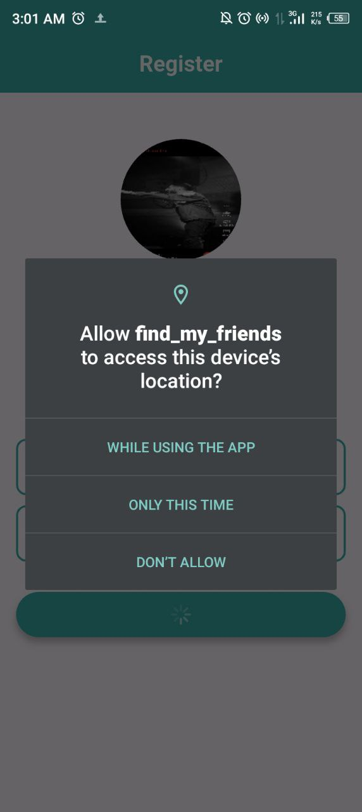
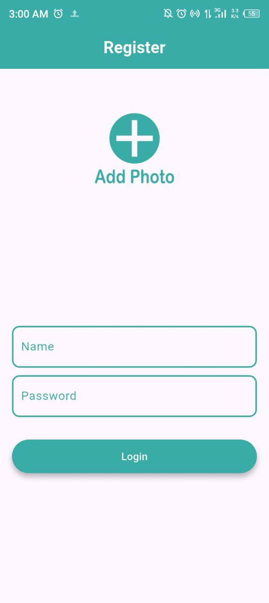
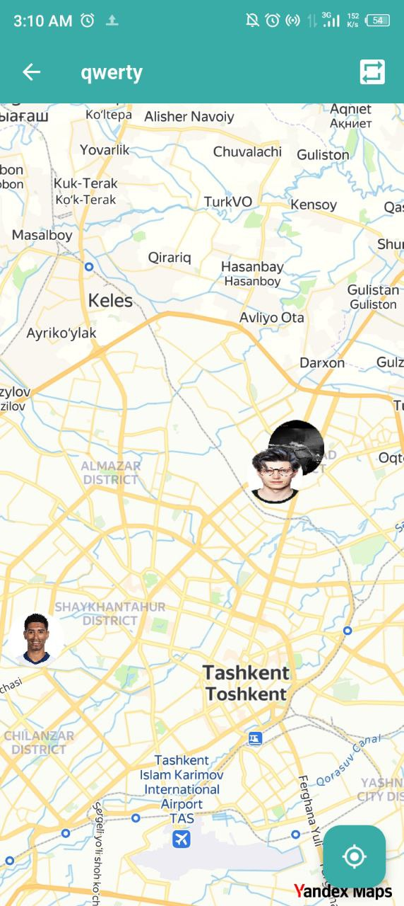
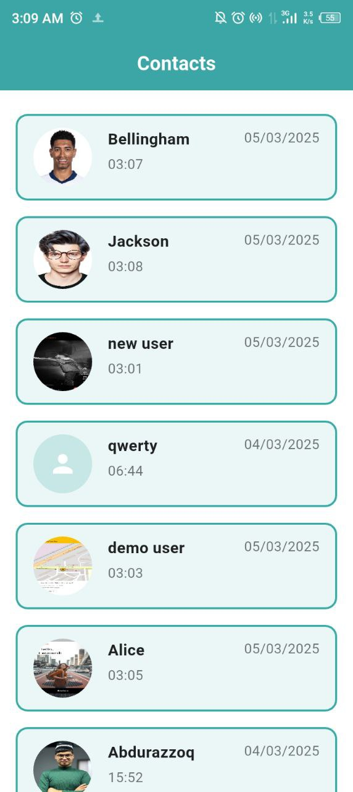

### 🗺️ Find My Friends (Flutter)
Find My Friends is a real-time location-sharing app that helps users stay connected with friends by
viewing their locations on a map. The app features a secure login system, a contact list of
registered users, and an interactive map to track and update locations.

---

### 📱 App Overview
Login Screen: Users enter their name, password, and upload an image (saved to Firebase as bytecode).
Contacts Screen: Displays all registered users with their name, image, and last updated time.  
Map Screen:  
Selecting a user zooms in on their location while showing all other users.  
An Update button refreshes the user’s location and timestamp.  
A Current Location button zooms into the user’s own position.  
The app ensures smooth performance with efficient data handling and real-time updates.

---

### ⚙️ Technologies Used
- **Flutter**: Cross-platform development for Android and iOS.
- **Firebase**: Stores user data, including images as bytecode.
- **Hive**: Saves registration status locally.
- **Maps Integration**: Yandex map displays all users' locations interactively.
- **Real-Time Updates**: Allows users to update their location and timestamp.

--- 

### 🖼️ Screenshots

<table>
  <tr>
    <td></td>
    <td></td>
  </tr>
  <tr>
    <td></td>
    <td></td>
  </tr>
</table>